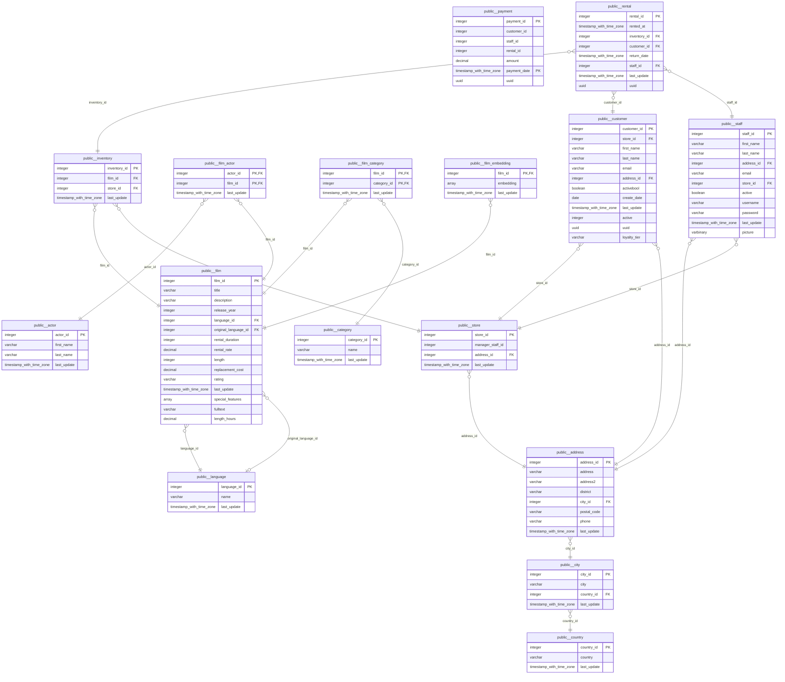

# Silver ER diagram

Relationships are the `relationships` tests generated from declared foreign keys — the same constraints the source declares, now verified on every run.

```mermaid
erDiagram
  public__actor {
    integer actor_id PK
    varchar first_name
    varchar last_name
    timestamp_with_time_zone last_update
  }
  public__address {
    integer address_id PK
    varchar address
    varchar address2
    varchar district
    integer city_id FK
    varchar postal_code
    varchar phone
    timestamp_with_time_zone last_update
  }
  public__category {
    integer category_id PK
    varchar name
    timestamp_with_time_zone last_update
  }
  public__city {
    integer city_id PK
    varchar city
    integer country_id FK
    timestamp_with_time_zone last_update
  }
  public__country {
    integer country_id PK
    varchar country
    timestamp_with_time_zone last_update
  }
  public__customer {
    integer customer_id PK
    integer store_id FK
    varchar first_name
    varchar last_name
    varchar email
    integer address_id FK
    boolean activebool
    date create_date
    timestamp_with_time_zone last_update
    integer active
    uuid uuid
    varchar loyalty_tier
  }
  public__film {
    integer film_id PK
    varchar title
    varchar description
    integer release_year
    integer language_id FK
    integer original_language_id FK
    integer rental_duration
    decimal rental_rate
    integer length
    decimal replacement_cost
    varchar rating
    timestamp_with_time_zone last_update
    array special_features
    varchar fulltext
    decimal length_hours
  }
  public__film_actor {
    integer actor_id PK,FK
    integer film_id PK,FK
    timestamp_with_time_zone last_update
  }
  public__film_category {
    integer film_id PK,FK
    integer category_id PK,FK
    timestamp_with_time_zone last_update
  }
  public__film_embedding {
    integer film_id PK,FK
    array embedding
    timestamp_with_time_zone last_update
  }
  public__inventory {
    integer inventory_id PK
    integer film_id FK
    integer store_id FK
    timestamp_with_time_zone last_update
  }
  public__language {
    integer language_id PK
    varchar name
    timestamp_with_time_zone last_update
  }
  public__payment {
    integer payment_id PK
    integer customer_id
    integer staff_id
    integer rental_id
    decimal amount
    timestamp_with_time_zone payment_date PK
    uuid uuid
  }
  public__rental {
    integer rental_id PK
    timestamp_with_time_zone rented_at
    integer inventory_id FK
    integer customer_id FK
    timestamp_with_time_zone return_date
    integer staff_id FK
    timestamp_with_time_zone last_update
    uuid uuid
  }
  public__staff {
    integer staff_id PK
    varchar first_name
    varchar last_name
    integer address_id FK
    varchar email
    integer store_id FK
    boolean active
    varchar username
    varchar password
    timestamp_with_time_zone last_update
    varbinary picture
  }
  public__store {
    integer store_id PK
    integer manager_staff_id
    integer address_id FK
    timestamp_with_time_zone last_update
  }
  public__address }o--|| public__city : "city_id"
  public__city }o--|| public__country : "country_id"
  public__customer }o--|| public__store : "store_id"
  public__customer }o--|| public__address : "address_id"
  public__film }o--|| public__language : "language_id"
  public__film }o--o| public__language : "original_language_id"
  public__film_actor }o--|| public__actor : "actor_id"
  public__film_actor }o--|| public__film : "film_id"
  public__film_category }o--|| public__film : "film_id"
  public__film_category }o--|| public__category : "category_id"
  public__film_embedding }o--|| public__film : "film_id"
  public__inventory }o--|| public__film : "film_id"
  public__inventory }o--|| public__store : "store_id"
  public__rental }o--|| public__inventory : "inventory_id"
  public__rental }o--|| public__customer : "customer_id"
  public__rental }o--|| public__staff : "staff_id"
  public__staff }o--|| public__address : "address_id"
  public__staff }o--|| public__store : "store_id"
  public__store }o--|| public__address : "address_id"
```
